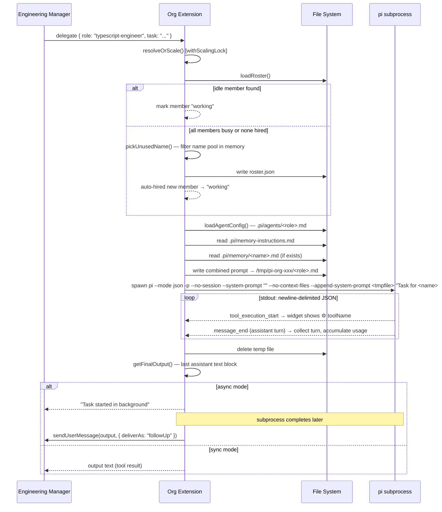

# pit2 — Technical Reference

pit2 implements an AI-powered software engineering organisation on top of the [pi coding agent](https://github.com/mariozechner/pi) framework.

## Architecture

The system is hierarchical:

- The **top-level pi session** runs as the Engineering Manager
- **Team members** are isolated pi subprocesses, each given a role-specific system prompt
- The **org extension** wires everything together: it registers the `delegate` tool and the `/team`, `/roles`, `/hire`, `/fire` commands
- A **roster file** tracks who is hired to which role

Members have no shared state and cannot communicate with each other. All coordination happens through the Engineering Manager.

## Key files

| Path | Purpose |
|---|---|
| `AGENTS.md` | User guide — loaded into every LLM context window; keep concise |
| `.pi/SYSTEM.md` | Engineering Manager system prompt |
| `.pi/roster.json` | Team roster: members, roles, hire dates, used name pool |
| `.pi/agents/*.md` | Role definitions — YAML frontmatter + agent system prompt |
| `.pi/extensions/org/index.ts` | Core extension: delegate tool, hire/fire/team/roles commands |
| `docs/features.md` | Formal feature specifications |

## Role definition format

Role files live in `.pi/agents/<role-name>.md`. They use YAML frontmatter followed by the agent's system prompt body.

```yaml
---
name: role-name          # lowercase-hyphenated; must match filename
description: ...         # one sentence; shown in /roles and the team roster
tools: read, bash, ...   # comma-separated list of pi tool names
model: claude-...        # optional; overrides the default model for this role
---

The body text becomes the --append-system-prompt content for the subagent.
It is appended after pi's default system prompt, so focus on role-specific
instructions rather than repeating general tool usage.
```

## Adding a new role

1. Create `.pi/agents/<role-name>.md` with valid frontmatter and a system prompt body
2. Run `/roles` to confirm it appears
3. Run `/hire <role-name>` to staff it

## Subagent spawning

When a task is delegated, the extension spawns a fresh `pi` subprocess:

```
pi --mode json -p --no-session --system-prompt "" --no-context-files \
   [--model <model>] [--tools <tool,...>] \
   --append-system-prompt <tmpfile> \
   "Task for <name>: ..."
```

- `--mode json` — output is newline-delimited JSON events
- `-p` — non-interactive (print) mode
- `--no-session` — no session persistence; each invocation is isolated
- `--system-prompt ""` — clears pi's default system prompt so only the role prompt applies
- `--no-context-files` — prevents pi from auto-loading project context files
- `--append-system-prompt <tmpfile>` — the role's system prompt (plus memory block) is written to a temp file and injected here; the file is deleted immediately after the process exits

The task string is the final positional argument, prefixed with `Task for <name>: `.

## Name pool

Team members are assigned names from a fixed pool of 30 gender-neutral names. Names are never reused within a project — once assigned (even to a fired member), a name is retired. This means the absolute maximum team size over the project's lifetime is 30 members.

## Delegation — end-to-end flow

This section describes what happens inside the extension from the moment the EM calls `delegate` to when results are returned.

### Member resolution and auto-scaling

Every delegation call goes through `resolveOrScale()`. Named-member lookups that find an idle member resolve immediately without acquiring any lock. The `withScalingLock` mutex (scoped per working directory) is only entered on the role-based resolution path — and when a named member is busy and falls through to role-based lookup — to prevent parallel hire races.

1. **By name** (`member: "Casey Kim"`): looks up the named member on the roster. If they are not `working`, marks them `working` and returns. If they are busy, falls through to role-based resolution using their role.
2. **By role** (`role: "typescript-engineer"`): finds the first roster member with that role whose state is not `working`. If one is found, marks them `working` and returns.
3. **Auto-hire** (all role members busy or none hired): loads the role config, picks an unused name from the pool, writes the updated roster to disk, sets the new member's state to `working`, and returns with `hired: true`. The member persists on the roster after the task completes.

If the name pool is exhausted (all 30 names used) and no idle member exists, delegation fails immediately.

### Subprocess construction

Once a member is resolved, the extension:

1. Reads `.pi/memory-instructions.md` (or falls back to a hardcoded string) and substitutes `${memberName}` and `${memPath}` placeholders.
2. Reads the member's memory file (`.pi/memory/<name>.md`) if it exists; appends its contents to the memory block.
3. Concatenates the role's system prompt body with the memory block.
4. Writes the combined prompt to a temporary file in a `mkdtemp` directory.
5. Spawns the `pi` subprocess with the flags described in [Subagent spawning](#subagent-spawning).
6. Deletes the temp file as soon as the process exits.

### JSON event streaming

The subprocess writes newline-delimited JSON to stdout. The extension processes two event types:

| Event | `type` field | Action |
|---|---|---|
| Turn complete | `message_end` | Appends the message to the turn list; extracts token usage from `message.usage`; calls `onProgress` with the latest output text |
| Tool call starting | `tool_execution_start` | Emits a `⚙ <toolName>` snippet to the live widget streamer |

The widget refreshes on a 150 ms debounce to avoid flooding the UI during fast-streaming tasks.

### Result extraction

After the process exits, `getFinalOutput()` scans the collected messages from the last to the first, returning the `text` content of the first `assistant`-role message it finds. This is the member's final response, with any intermediate tool-use turns discarded.

### Sync vs async result delivery

Whether a delegation is synchronous or asynchronous is determined by `params.async ?? asyncMode` (the per-call override takes precedence over the session flag).

- **Sync**: the extension `await`s the subprocess, then returns the output directly as the tool result. The EM's turn does not proceed until the work is complete.
- **Async**: the extension starts the subprocess in a detached promise (fire-and-forget), immediately returns `"Task started in background"` to the EM, and calls `pi.sendUserMessage(content, { deliverAs: "followUp" })` when the task completes. This injects the result into the conversation as a follow-up user message, prompting a new EM response.

For parallel async tasks, each task delivers its own follow-up independently as it finishes. For async chain mode, a single combined follow-up is delivered when all steps complete (or the chain halts on failure).



---

## Per-member memory

Every team member has a persistent memory file that accumulates project knowledge across delegations. The system injects memory on every delegation and instructs agents to update it before they respond.

### Memory file location

`.pi/memory/<member-name>.md` — where `<member-name>` is the member's full name lowercased and hyphenated (e.g. `casey-kim`). Files are created by agents on first write; no setup is required.

### Instructions source

The extension reads `.pi/memory-instructions.md` fresh on every delegation. It substitutes two placeholders:

| Placeholder | Replaced with |
|---|---|
| `${memberName}` | The member's full name |
| `${memPath}` | Absolute path to their memory file |

If the file is missing or unreadable, the extension falls back to a hardcoded instruction string that conveys the same behaviour.

### System prompt injection

The memory block is appended to the role's system prompt (not to the task string) before the temp file is written. The injected block has the form:

```
---
## Your Identity & Memory

Your name is <name>. Your memory file is at <path>.

<instructions from memory-instructions.md>

<full contents of existing memory file, if any>
```

If the memory file exists and has content, it is inlined immediately after the instructions so the agent sees its prior knowledge without needing to make a file read call first — though the instructions also direct agents to read the file at task start to confirm they have the latest version.

### Agent behaviour

Agents are instructed to:

1. **Read** their memory file at the start of the task (if it exists) to recall relevant context.
2. **Perform** the task.
3. **Update** their memory file silently — using `write` or `edit` — before producing their final response. No commentary or confirmation about the update.
4. **Produce no text** after the final response.

Content and format are left to the agent. Typical entries cover project conventions, key file locations, architectural decisions, and pitfalls encountered.

### Lifecycle

- Memory files **persist across sessions** — they are the only team state that does. (Token usage, task status, and async mode all reset on session start.)
- Firing a member via `/fire` or the `fire` tool **deletes** their memory file.
- There is **no automatic pruning** — agents are responsible for keeping their own files accurate and concise.
- Memory is **per-member, not per-role** — two members with the same role maintain independent memories.

```mermaid
sequenceDiagram
    participant Ext as Org Extension
    participant FS as File System
    participant Sub as Subagent

    Note over Ext: delegation begins
    Ext->>FS: read .pi/memory-instructions.md
    Note over Ext: substitute ${memberName}, ${memPath}<br/>(fallback to hardcoded string if missing)
    Ext->>FS: read .pi/memory/<name>.md
    Note over Ext: inline existing contents into memory block
    Ext->>FS: write temp file (role prompt + memory block)
    Ext->>Sub: spawn subprocess
    Sub->>FS: read .pi/memory/<name>.md (task start)
    Sub->>Sub: perform task
    Sub->>FS: write/edit .pi/memory/<name>.md (before final response)
    Sub-->>Ext: final response text
    Note over Ext: temp file deleted; result returned
```

---

## Pi framework

The pi package is a global npm module. Its location varies by environment; on the reference machine:

```
/Users/richardthombs/.nvm/versions/node/v24.13.1/lib/node_modules/@mariozechner/pi-coding-agent/
├── docs/         # Framework reference documentation
└── examples/
    └── extensions/
        └── subagent/   # The subagent pattern pit2 builds on
```

> This path is environment-specific. Run `npm root -g` or `which pi` to locate it in other environments.
