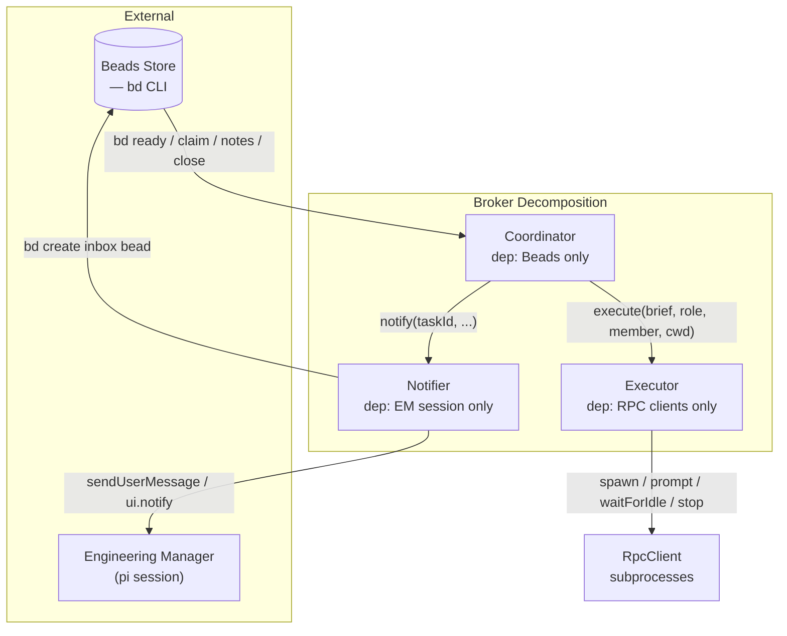
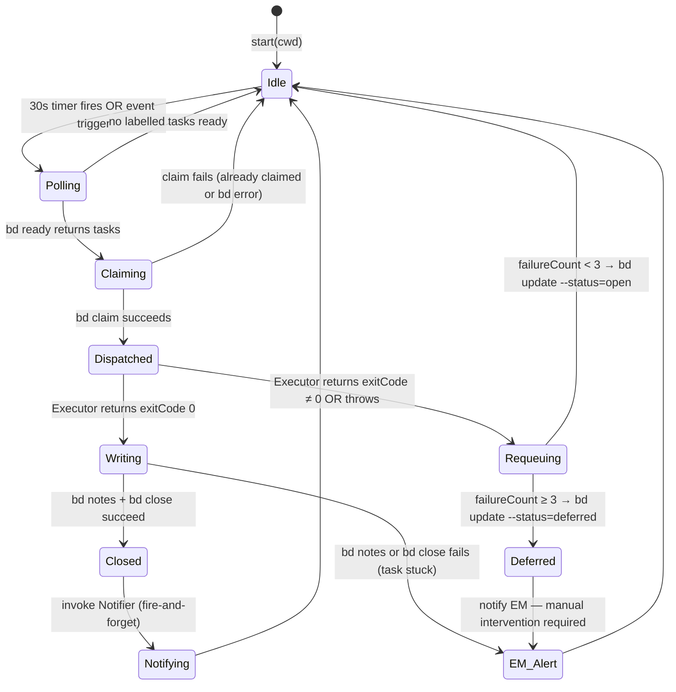

# Design: Coordinator / Executor / Notifier Decomposition of the Broker

**Status:** Implemented — 2026-05-03. See `coordinator.ts`, `executor.ts`, `notifier.ts`.  
**Author:** Emery Vidal  
**Date:** 2026-05-03  
**Bead:** pit2-3c0u.1

---

## 1. Problem Statement

`broker.ts` currently tangles three unrelated concerns into one class:

| Concern | Examples in current code |
|---|---|
| **Coordination** — bead state transitions | `_dispatchCycle`, `_requeueTask`, `captureResult`, `failureCounts` |
| **Execution** — agent process management | `runTask`, `liveMembers`, `waitForIdleOrExit`, memory init, memory phase |
| **Delivery** — getting results to the EM | `_writeMessageToInbox`, `scheduleInboxPing`, `drainInbox` |

Every coupling point between these concerns is a failure mode: the Coordinator must know about RPC clients (to evict them), the Executor must know about beads (to know when the memory phase is appropriate), and the Notifier is inlined into the write queue rather than independently testable.

The decomposition gives each component exactly one external dependency, making each independently replaceable and testable.

---

## 2. Component Diagram



**Dependency summary:**

| Component | Only depends on | Has no knowledge of |
|---|---|---|
| Coordinator | `bd` CLI | RPC clients, EM session, inbox beads |
| Executor | RpcClient API | beads, EM session, inbox beads |
| Notifier | pi session API + `bd` CLI (inbox writes only) | RPC clients, dispatch cycle, retry logic |

---

## 3. Coordinator

### 3.1 Responsibilities

- Maintain a 30-second safety-net poll and respond to event-driven triggers (task created, task updated)
- On each dispatch cycle: fetch the ready queue, claim each labelled task, invoke Executor, capture the result
- Write Agent output to bead notes; close the bead with a human-readable reason string
- Track in-memory failure counts per task ID; requeue on failures 1–2; defer on failure 3
- Invoke Notifier after a successful close
- Serialise all bead writes through a per-cwd promise chain

### 3.2 Interface Exposed

```
start(cwd: string): void
  — Activates polling and triggers an immediate dispatch cycle.
  — Idempotent: safe to call again without stopping first.

stop(): void
  — Deactivates polling. In-flight tasks complete normally.
```

### 3.3 Interfaces Consumed

```
// Provided by Executor
execute(
  brief:      string,   // full task brief including bead ID fetch instructions
  role:       string,   // role slug (e.g. "typescript-engineer")
  memberName: string,   // display name of the assigned member
  cwd:        string,
) → Promise<{ output: string; exitCode: number; usage: UsageStats }>

Throws on process crash or timeout.
Never returns a partial result — caller treats any throw as a failure.


// Provided by Notifier
notify(
  cwd:        string,
  taskId:     string,
  taskTitle:  string,
  role:       string,
  memberName: string,
  output:     string,
) → Promise<void>

Fire-and-forget from the Coordinator's perspective.
Coordinator does NOT await this — it enqueues and moves on.
Notifier errors are non-fatal to the dispatch cycle.
```

### 3.4 Coordinator State Machine

The Coordinator runs a simple loop. There is no complex state machine — each task moves linearly through claim → execute → write → close, with requeue/defer as the error branch.



**Dispatch algorithm (prose):**

1. Call `bd ready --type=task --json`. Parse the list. If the call fails, notify the EM and return.
2. For each task in the list:
   a. Skip tasks with no role label (EM-owned).
   b. Check the in-memory failure counter. If ≥ 3, notify the EM and skip.
   c. Call `resolveOrScale` to find or hire a member for the required role. If no member is available (error result), skip.
   d. Call `bd update <id> --claim`. If this returns "already claimed", notify the EM and skip. Other errors: notify and skip.
   e. Fire `_runAndClose(cwd, task, role, member)` without awaiting it (tasks execute in parallel). The write queue is only held during the claim step.
3. Return. The next dispatch cycle fires on the next 30-second tick or the next event trigger.

**Eviction before execution:**

Before calling `Executor.execute()`, the Coordinator instructs the Executor to evict any existing client for the member. This ensures the agent sees only the current task brief with no residue from a previous session.

The Coordinator does this by calling `executor.evict(cwd, memberName)` before `executor.execute(...)`.

```
// additional Executor interface method
evict(cwd: string, memberName: string): Promise<void>
  — Stops and removes the live client for this member, if one exists.
  — No-op if no client exists.
```

**Failure counter semantics:**

- Counter is in-memory, keyed by task ID
- Incremented after each failed execution (non-zero exit code or thrown exception)
- Never decremented — a task that succeeds on retry is closed; counter no longer matters
- Resets when the broker process restarts (not persisted)
- At count 1 and 2: `bd update --status=open` + notify EM "attempt N/3"
- At count 3: `bd update --status=deferred` + notify EM "deferred, manual intervention required"
- After deferral, the task stays off the ready queue until the EM resets it manually

**Write serialisation:**

All `bd` write calls (claim, notes, close, requeue, defer) are serialised through a per-cwd promise chain (`writeQueue`). `execute()` is NOT serialised — agents run in parallel. The write chain re-enqueues itself after each step; errors are caught and forwarded to the EM without breaking the chain.

---

## 4. Executor

### 4.1 Responsibilities

- Maintain a pool of persistent `RpcClient` subprocesses, keyed by `cwd + memberName`
- Evict (stop and remove) a client on demand before each task
- Spawn a fresh client when `execute()` is called and no live client exists
- On first use of a fresh client: inject the role memory file contents (memory init phase)
- Send the task brief prompt; monitor stream activity; collect the final assistant text
- After successful execution: run the memory update phase (prompt the agent to update its memory file)
- Return `{ output, exitCode, usage }` to the Coordinator
- Manage client lifecycle: idle reaping (clients unused for 10 minutes are stopped), crash recovery (process-exit listener removes dead clients from the pool)

### 4.2 Interface Exposed

```
execute(
  brief:      string,
  role:       string,   // used to locate the role memory file
  memberName: string,
  cwd:        string,
) → Promise<{ output: string; exitCode: number; usage: UsageStats }>

Successful execution:   exitCode 0,  output = final assistant text
Empty output (no text): exitCode 1,  output = "(no output)"
Process crash / timeout: throws Error with descriptive message

evict(
  cwd:        string,
  memberName: string,
) → Promise<void>
  — Stops and removes any live client. No-op if none exists.
```

### 4.3 Client Pool

**Key format:** `${cwd}::${memberName}` — scoped by project so that two open projects do not share clients.

**Pool entry:**
```
{
  client:      RpcClient   — the live subprocess
  lastUsed:    number      — Date.now() at the start of the most recent execute() call
  initialized: boolean     — true after memory-init prompt has been sent and acknowledged
}
```

**Lifecycle events:**
- `evict()` is called by the Coordinator before each task; it stops the client and removes the entry
- `execute()` calls `getOrCreate()`: if an entry exists, update `lastUsed` and return the client; otherwise spawn a new one
- On process exit (crash between tasks): the `exit` listener removes the entry so the next call creates a fresh client
- The idle reaper (called by the session's 60-second interval) removes entries where `lastUsed` is more than 10 minutes ago

**`execute()` contract:**

```
getOrCreate(role, memberName, cwd)
  → if not initialized: run memory init (inject role memory → waitForIdle 30s)
  → set initialized = true

send prompt: "Task for {memberName}: {brief}"
race:
  - client.waitForIdle(TASK_MAX_TIMEOUT_MS)     // absolute backstop: 30 minutes
  - exit poll (500ms interval)                   // reject if process exits early
  - inactivity timer (60s without stream events) // reject if stream goes silent
whichever resolves/rejects first wins

on success:
  output = client.getLastAssistantText()
  if output is empty → return { exitCode: 1, output: "(no output)", usage }
  → run memory phase (see §5)
  → return { exitCode: 0, output, usage }

on error (timeout, crash, empty):
  remove client from pool, stop process
  throw Error
```

**Error propagation:** The Executor never swallows errors from `execute()` — it always throws or returns a non-zero exit code. The Coordinator decides whether to requeue or defer.

### 4.4 Usage Accumulation

The Executor accumulates per-task token usage from `message_end` events on the RPC stream and returns it in the result. The Coordinator passes usage to whichever component is responsible for displaying/persisting it (currently `accumulateMemberUsage` in `index.ts`). For this design, usage flows back through the `execute()` return value; the Coordinator forwards it to an optional usage callback injected at construction time.

---

## 5. Memory Phase

**Location:** Inside the Executor, as a post-execution step within `execute()`, after the task output is collected and before the result is returned to the Coordinator.

**Rationale:** The Executor owns the client. At the point the task output is captured, the client is still live and the conversation context is intact. Running the memory prompt here avoids any need for the Coordinator to know a client exists, and avoids the Notifier having to reach back into the Executor. The Coordinator simply receives a completed result — it has no visibility into whether a memory phase ran.

**Algorithm:**

```
if exitCode === 0 and client is alive:
  enqueue on per-role memory phase chain:
    client.prompt("Memory update phase: review your memory file and update it
                   if anything from the task you just completed is worth
                   recording. Do not include any other commentary.")
    waitForIdleOrExit(client, 30_000)
```

**Per-role serialisation:** The Executor maintains a per-role (not per-member) memory phase queue. This prevents two members of the same role from running concurrent read-modify-write operations on the shared role memory file. The queue is a simple promise chain — errors are forwarded to the EM notification callback but do not block the chain.

**Memory phase is fire-and-forget from the Coordinator's perspective.** The `execute()` call returns as soon as the task output is collected; the memory phase runs asynchronously. This means the Coordinator can start the next write queue step (notes + close) without waiting for memory to complete. The only ordering guarantee needed is that two members of the same role don't overlap on the memory file.

---

## 6. Notifier

### 6.1 Responsibilities

- Accept a completed task result (IDs, metadata, and output text)
- Write a task-completion message bead to the beads store, assigned to `em/`
- Trigger the ping+drain delivery mechanism to wake the EM

### 6.2 Interface Exposed

```
notify(
  cwd:        string,
  taskId:     string,
  taskTitle:  string,
  role:       string,
  memberName: string,
  output:     string,
) → Promise<void>
```

### 6.3 Ping+Drain Mechanism

The ping+drain mechanism is already implemented. The Notifier wraps it without modification.

**Inbox bead write:**

```
bd create "{taskTitle}" \
  --type=task \
  --assignee=em/ \
  --labels=pit2:message,msg-type:task-complete,from:{memberSlug} \
  --description="{header}\n\n{output}" \
  --metadata="{task_id, role, member_name}"
```

If this write fails, the Notifier falls back to `notifyEM()` (the EM's `sendUserMessage` callback), delivering the full header + output directly without an inbox bead.

**Ping:**

After a successful bead write, the Notifier calls `scheduleInboxPing(cwd)`. The ping is debounced at 10 seconds. If the EM is busy when it fires, it retries up to 5 times at 5-second intervals. On finding the EM idle, it calls `pi.sendUserMessage("📬", { deliverAs: "followUp" })`.

**Drain:**

The `agent_end` event handler calls `drainInbox(cwd)`. This queries the beads store for open `pit2:message` beads assigned to `em/`, ACKs (closes) the first one, then sends its `description` as a follow-up message. The follow-up triggers another `agent_end`, chaining delivery until the inbox is empty.

**Notifier guarantees:**

- Delivers exactly once (ACK-before-send)
- If close succeeds but send fails: bead is already closed but content is preserved in `description` for manual recovery
- If close fails: bead remains open and will be retried on the next `agent_end`
- Notifier errors never propagate back to the Coordinator — all failures result in EM notification via the fallback path

---

## 7. Data Flow Summary

```
EM creates task bead
        │
        ▼
Coordinator.onTaskCreated(cwd)
        │
        ▼
Coordinator: bd ready → filter labelled tasks → claim
        │
        ▼
Executor.evict(cwd, memberName)          ← remove any prior client
        │
        ▼
Executor.execute(brief, role, member, cwd)
    ├── getOrCreate client
    ├── memory init (first use)
    ├── send prompt → race(idle, exit-poll, inactivity, backstop)
    ├── collect output
    └── memory phase (per-role serialised, fire-and-forget)
        │
        ▼ { output, exitCode, usage }
        │
Coordinator: exitCode 0?
    ├── yes → bd update --append-notes
    │         bd close
    │         Notifier.notify(...)       ← fire-and-forget
    │         ▼
    │      Notifier: bd create inbox bead
    │               scheduleInboxPing
    │               ──────────────────────────────►
    │                   (10s debounce) → sendUserMessage("📬")
    │                   EM agent_end → drainInbox → sendUserMessage(content)
    └── no  → Coordinator: increment failureCount
              failureCount < 3 → bd update --status=open
              failureCount ≥ 3 → bd update --status=deferred
              notifyEM(...)
```

---

## 8. Migration Path

The goal is to extract one component at a time without breaking the running system. Each step should leave the broker in a working state.

### Step 1: Extract Notifier

**What to do:**
- Create `notifier.ts` with a `Notifier` class exposing `notify(cwd, taskId, taskTitle, role, memberName, output): Promise<void>`
- Move `_writeMessageToInbox()` into `Notifier.notify()`
- Move the inbox-write fallback logic (the `try/catch` around `_writeMessageToInbox` in `_runAndClose`) into `Notifier.notify()` — Notifier owns both the happy path and the fallback
- `Notifier` receives `scheduleInboxPing` and `notifyEM` callbacks via its constructor or a `configure()` call
- In `broker.ts`, replace the inline `_writeMessageToInbox` call with `notifier.notify(...)`

**What stays in broker.ts:** Everything else. The write queue still serialises the `notify()` call for now.

**What gets deleted:** `_writeMessageToInbox()` from `broker.ts`

### Step 2: Extract Executor

**What to do:**
- Create `executor.ts` with an `Executor` class exposing `execute()` and `evict()`
- Move into Executor: `liveMembers` map, `getOrCreateClient()`, `initializeClientMemory()`, `waitForIdleOrExit()`, `waitForIdleWithActivityTimeout()`, `buildMemberSystemPromptFile()`, `reapIdleClients()`, `stopLiveClient()`, `TASK_INACTIVITY_TIMEOUT_MS`, `TASK_MAX_TIMEOUT_MS`, `MEMORY_INIT_TIMEOUT_MS`
- Move the memory phase (`_enqueueMemoryPhase` + the phase 2b block in `_runAndClose`) into `Executor.execute()`
- `Executor` receives a `notifyEM` callback for memory phase error reporting
- In `broker.ts`, replace the inline evict+runTask block with `executor.evict()` + `executor.execute()`
- Remove: `getLiveClient`, `evictLiveClient` from the `configure()` call (Executor manages the pool internally); remove `scheduleDoneReset` moving it to `index.ts` wired directly

**What stays in broker.ts:** Coordination logic — polling, claiming, write queue, failure counting, requeue/defer, `captureResult`

**What gets deleted:** `_runBdRetry` stays in Coordinator (it's bd-specific); `memoryPhaseQueue` moves to Executor; `getLiveClient`/`evictLiveClient` callbacks removed from `configure()`

### Step 3: Refactor Coordinator

**What to do:**
- Rename `broker.ts` to `coordinator.ts`; rename `Broker` → `Coordinator`
- Remove the now-empty stubs: `getLiveClient`, `evictLiveClient`, memory phase queue
- `configure()` simplifies to: `runBd`, `resolveOrScale`, `executor`, `notifier`, `memberState`, `notifyEM`, `scheduleDoneReset`, `accumulateMemberUsage`, `scheduleInboxPing`
- Update `index.ts` to import `Coordinator` and wire up the trimmed dependency list

**What gets deleted:** All dead code exposed by the prior two extractions

### Step 4: Update index.ts wiring

- `index.ts` constructs all three components and injects their dependencies:
  ```
  const notifier  = new Notifier(runBd, scheduleInboxPing, notifyEM);
  const executor  = new Executor(notifyEM, onUsage);
  const coordinator = new Coordinator(runBd, resolveOrScale, executor, notifier, memberState, notifyEM, scheduleDoneReset);
  ```
- Remove the `configure()` call or simplify it to match the new constructor signatures
- `broker.start(cwd)` → `coordinator.start(cwd)`
- Move `reapIdleClients()` and the context-usage polling loop into `Executor` or keep them in `index.ts` — whichever is cleaner; the reaperInterval wiring stays in `index.ts`

---

## 9. What Is Deliberately Out of Scope

These are things the current broker does (or could do) that are **not** part of this design. They can be added back later if needed.

- **Complex retry scheduling** — exponential backoff, per-role retry policies, per-task retry configuration. The Coordinator uses a simple fixed-count scheme (3 attempts, requeue immediately).
- **Priority ordering** — tasks are dispatched in the order `bd ready` returns them. No priority queue, no urgency scoring.
- **Parallel dispatch limits** — there is no cap on how many tasks can be dispatched simultaneously. If 10 tasks are ready, all 10 are fired at once. Rate limiting or concurrency caps are not modelled.
- **Cross-cwd coordination** — the design is per-project. A single broker instance managing multiple projects simultaneously is not covered.
- **Persistent failure state** — failure counts reset when the process restarts. Persistent failure tracking (surviving restarts) is not included.
- **Supervisor / watchdog** — the Executor has process-exit recovery within a session, but there is no higher-level supervisor that restarts the Coordinator if it itself crashes.
- **Task routing beyond role label** — dispatch is purely label-based. Skills, specialisations, or workload-aware routing are not in scope.
- **Notifier acknowledgement back to Coordinator** — Notifier success/failure does not affect the Coordinator's state. Delivery confirmation tracking is not in scope.
