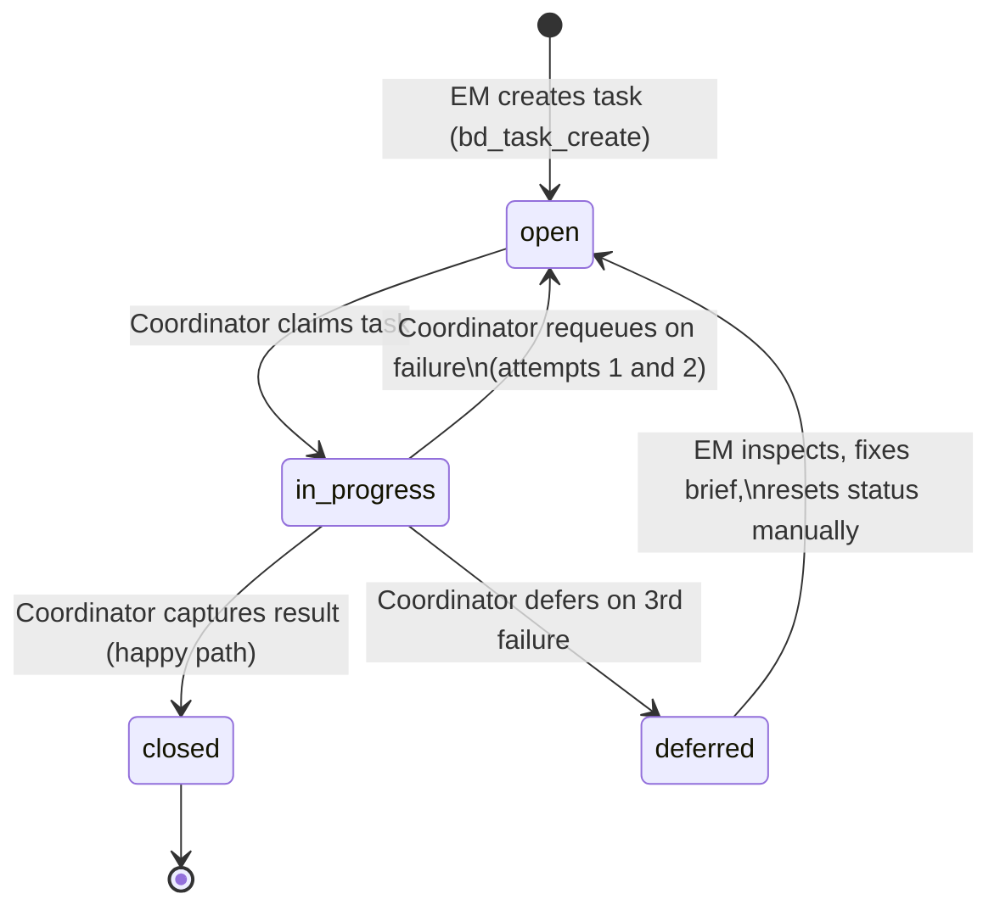
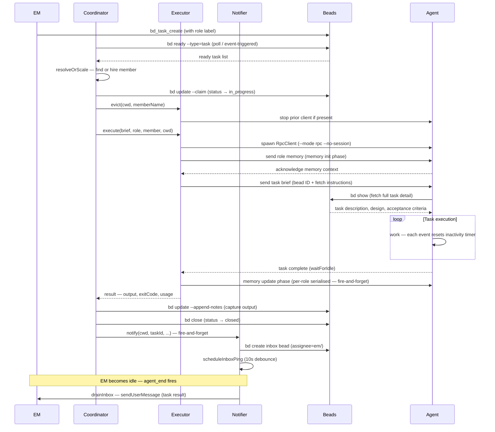
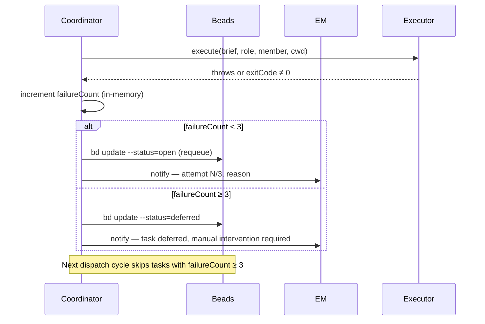
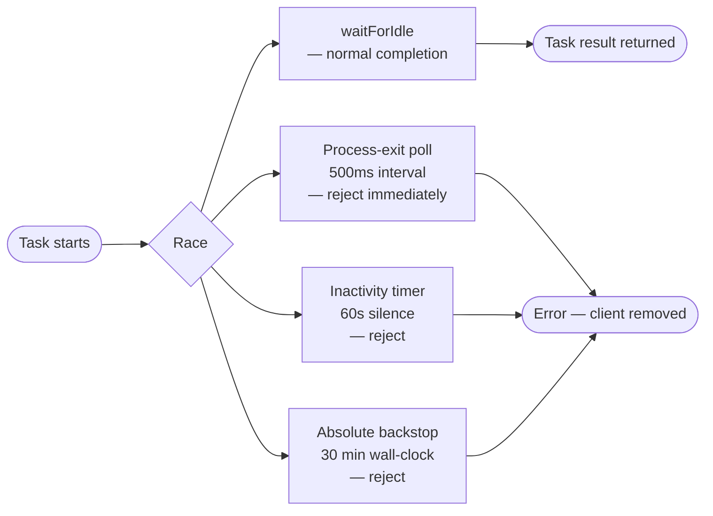

# System Interactions: EM, Coordinator/Executor/Notifier, and Agents

A conceptual reference describing how the Engineering Manager, Coordinator, Executor, Notifier, and Team Agents interact — what each component is responsible for, how information flows between them, and what happens at each stage of a task's life.

---

## 1. Overview

The pit2 system coordinates software engineering work across three roles: the Engineering Manager (EM) owns the work queue and communicates results to the user; the Coordinator, Executor, and Notifier together autonomously pick up ready tasks from that queue and route them to Agent processes; and Agents receive individual task briefs, execute the work, and return their output. These components operate without the EM's direct involvement once tasks are created, delivering results back to the EM via an inbox mechanism. This separation allows multiple tasks to run in parallel across different roles while the EM remains responsive to the user.

---

## 2. Component responsibilities

**Engineering Manager (EM)** — The EM is the user-facing coordinator. It creates epics and task beads in the beads store, sets the role labels that control coordinator dispatch, monitors the team widget for live status, reads inbox notifications when tasks complete, and closes epics when a workstream is done. The EM does not execute tasks directly; it manages the queue.

**Coordinator** — The Coordinator is the autonomous dispatcher that runs in the background throughout a session. It polls the beads ready queue, claims each task that has a role label, resolves or hires a team member for the required role, invokes the Executor to run the Agent, captures the result, and delegates delivery to the Notifier. The Coordinator serialises all beads writes through a per-project queue to prevent concurrent write conflicts. It tracks in-memory failure counts and decides whether to requeue or defer a task after a failure.

**Executor** — The Executor owns the pool of persistent Agent subprocesses. For each task it evicts any prior client for the assigned member, spawns a fresh RpcClient process, injects the role memory, sends the task brief, and monitors the stream with inactivity, process-exit, and absolute-backstop guards. After a successful task it runs the memory update phase on a per-role serialised queue before returning the result to the Coordinator.

**Notifier** — The Notifier is responsible for getting task results back to the EM. It writes a completion message bead to the beads store (assigned to `em/`), then triggers the ping-and-drain delivery mechanism. It handles its own error fallback — if the inbox write fails it delivers the result directly via `sendUserMessage`. Errors never propagate back to the Coordinator.

**Agent** — An Agent is a persistent subprocess representing one team member. On first use it receives its role prompt and any existing role memory. For each task it is given a brief telling it where to find the full task specification in beads. It executes the work using the tools available to its role, returns its output, and then undergoes a memory update phase where it reviews and updates the shared role memory file.

---

## 3. Task lifecycle

---

## 4. Happy-path dispatch sequence

---

## 5. Failure handling

---

## 6. Inactivity and process-exit detection

While a task is executing, three concurrent guards protect against hung or crashed Agent processes.

The **stream activity watch** resets a 60-second timer on every event that arrives from the Agent. If no event is received for 60 consecutive seconds, the task is rejected as stuck. The **process-exit watch** polls the child process every 500 ms; if it exits before sending an idle signal, the task is rejected immediately rather than waiting for the full timeout. The **absolute backstop** of 30 minutes applies regardless of activity and is a last-resort guard that should never be reached under normal operation.

---

## 7. Inbox delivery

Results reach the EM through two complementary mechanisms. Either one is sufficient for delivery.

**Proactive ping:** After writing an inbox bead, the Notifier schedules a ping with a 10-second debounce. If the EM is busy when the ping fires, it retries up to 5 times at 5-second intervals. On each retry that finds the EM idle, `sendUserMessage` delivers the inbox content as a follow-up turn. If `sendUserMessage` fails, a `ui.notify` call serves as a fallback.

**Passive drain:** Every time the EM completes a turn (the `agent_end` event fires), `drainInbox` queries the beads store for any open inbox messages assigned to the EM. It delivers exactly one message per call — the resulting follow-up turn triggers `agent_end` again, chaining delivery until the inbox is empty.

Both mechanisms share the same ACK-before-send approach: the inbox bead is closed before `sendUserMessage` is called. This prevents double delivery. If sending fails after the ACK, the bead's description field retains the content for manual recovery.

The Notifier is the component that owns both mechanisms. The Coordinator calls `notifier.notify()` fire-and-forget — it does not await delivery and Notifier errors never affect the dispatch cycle.

---

## 8. Memory model

Each role has a single shared memory file at `.pi/memory/<role>.md`. All team members hired into the same role share one file; there is no per-member memory. When a fresh Agent client is started, the current contents of the role memory file are injected before the first task prompt. The Agent acknowledges the memory context and is then ready for work.

After each successful task, the Executor enqueues a memory update phase on a per-role serialised queue. Only one Agent for a given role runs its memory phase at a time, preventing concurrent read-modify-write races on the shared file. During the phase, the Agent is prompted to review its memory file and update it with anything worth recording. The Agent writes directly using its own file tools.

---

## 9. Key invariants

- A task is only dispatched when all tasks that block it are closed — `bd ready` enforces this before the Coordinator claims anything.
- Failure counts are in-memory and survive Coordinator stop/start within the same process. They are not persisted and reset when the process exits.
- Each Agent process starts with `--no-session` — no session files are written to the project working directory.
- Agents receive only their role prompt and role memory. The EM system prompt (`.pi/SYSTEM.md`) and shared context files (e.g. `AGENTS.md`) are not injected.
- Tasks dispatched to different roles run in parallel. Memory writes for the same role are serialised.
- An output that exceeds 60 KB causes the task to fail rather than be truncated — the EM is notified to revise the brief.
- Inbox delivery is at-most-once: the inbox bead is acknowledged (closed) before the message is sent to the EM.
